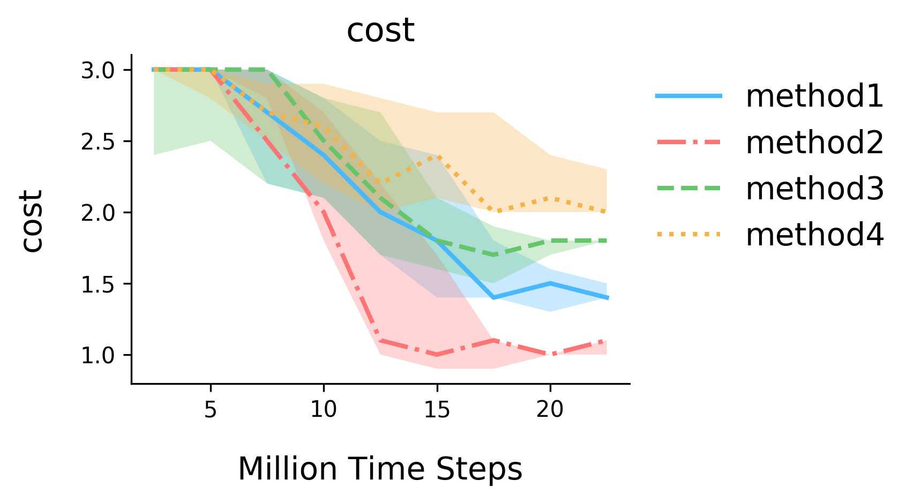

# Deep Learning Plotting Example

Some of the plotting code used in our paper, as an example for good-looking plots.

## General Styling Philosophy

1. **Frameless**. 
    
    Avoid frames on legends and the main plot unless necessary. Lines and frames add to visual cluttering, take up visual processing bandwidth in your brain, and distracts the reader's attention from the more relevant part of the figures.
    
    **General rule of visual attention**: attention = ink of interest / total ink in figure.
    
    So what does this mean? This means we 
    - **remove top and right frame,**
    - **remove frame of legend,** and
    - **remove border of line-markers and outline of variance**.
    
2. **Use of Color**

    Desaturated colors look the best to the eye. Either turn the alpha to 0.3 or 0.7 depends on the color, or directly desaturate color with color picker. 
    
    We are less sensitive to green than red, use different alpha value for these colors.
    
    **note**: my plots tend to be too light from time to time. This is just a personal thing. The optimal does change depends on the monitor, but with wider adoption of Macs with IPS panel, this is becoming less of a problem.
    
3. **Simpler Plot, Simpler Message**

    Sometimes we tend to want to put too much data into a single plot. This makes those plots harder to digest. We should make it easy for readers to understand what each plot is trying to show. Sympathy is an important part of communication.
    
    This means the best plot shows only the two things we want to compare, and maybe a baseline. Only plot multiple lines in the same plot if you have to, and/or they don't overlap substantially.
    
    When the plot has to contain overlapping lines, use extra plots in the appendix to show individual slices. If the plot is interactive this problem can be alleviated, but that's a whole other discussion.
    
4. **Accessibility**
    
    Personally, I like to use different line style and marker types for accessibility with the visually impaired. I prefer to avoid high-contrast or red-green color-blind palettes because they tend to be bad fix for a legitimate problem. Instead, I prefer to use styling for that purpose. This way, majority of the readers can still have the best possible experience, and the accessibility suffers none. 
    
5. Font Size
    
    Please use font-sizes that are legible in the actual paper. Fonts should not be too small to read, but also shall not be too obnoxiously large. Have some taste.
    
    Some of the numbers in these figures are a tag too small.
    
6. Font
    
    Some people prefer to use the same font family for text in the figure as the main LaTeX document. I don't feel strongly about this, because as long as the fonts are consistent using a different font for figures gives the figures a separate visual identity. 
    
    If you want to use a math font for the figures, you can override this with the `paramsrc` of `pyplot`.

7. Padding

    I almost forgot this one. Make sure you add some extra padding between the plotting area and the title, x/y-labels, and the legends. The default of `pyplot` tend to be too small, making the figure look busy.
    
8. Consistency Between Figures

    Try to use the same marker, line-style, or color code for the same thing across different plots. This shows logic in your choices, and makes the plots more consistent.
    
    Sometimes for legibility reasons collisions can not be avoided. This is okay if choices are made with care. 

## How To Run This Example

Plotting code grow out of simple script quickly, but this is okay because there is no emphasis on reuse.

**To run this code**, first install the python packages. Then run
```bash
python rebuttal_plots/plots.py
```

## Example plots:




**Ge Yang, Bradly Stadie 2018. Written with :heart:**
